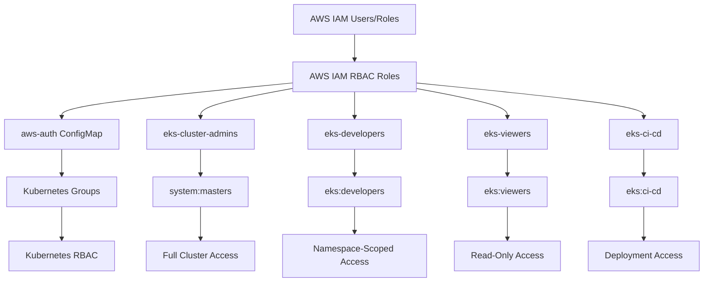

# EKS RBAC Configuration Guide

This guide explains the Role-Based Access Control (RBAC) system implemented for the EKS cluster.

## Overview

The EKS cluster implements a comprehensive RBAC system with four distinct tiers of access, following the principle of least privilege and separation of concerns.

## RBAC Architecture



## IAM Role Tier Structure

### 1. 🔴 eks-cluster-admins
**Purpose**: Platform team, emergency access, cluster operations

**Who Should Use**: 
- Platform/DevOps engineers
- SRE team members
- Break-glass emergency access

**Access Level**: Full cluster administrative access
- Kubernetes Group: `system:masters`
- Scope: Entire cluster
- MFA: Required in production environments

**Permissions**:
- All Kubernetes resources (create, read, update, delete)
- Cluster-level operations (nodes, cluster configuration)
- System namespace access (kube-system, kube-public)
- RBAC management

### 2. 🟡 eks-developers
**Purpose**: Application developers with namespace-scoped permissions

**Who Should Use**:
- Application developers
- Product teams
- QA engineers

**Access Level**: Namespace-scoped application management
- Kubernetes Group: `eks:developers`
- Scope: Configured application namespaces
- MFA: Optional (recommended for production)

**Permissions**:
- **Allowed Resources**:
  - Pods (create, read, update, delete)
  - Services (all operations)
  - Deployments, ReplicaSets (all operations)
  - ConfigMaps, Secrets (all operations)
  - Ingresses (all operations)
  - HorizontalPodAutoscalers (all operations)
  - NetworkPolicies (all operations)
  - PersistentVolumeClaims (all operations)

- **Cluster-level Read Access**:
  - Namespaces (list, get)
  - Nodes (read-only for debugging)

### 3. 🟢 eks-viewers
**Purpose**: Read-only access for monitoring, observability, and support

**Who Should Use**:
- Monitoring team
- Support engineers
- Business stakeholders
- Auditors

**Access Level**: Cluster-wide read-only access
- Kubernetes Group: `eks:viewers`
- Scope: Entire cluster (read-only)
- MFA: Not required

**Permissions**:
- Read access to all standard resources
- Metrics access (metrics.k8s.io API)
- Event access for troubleshooting
- Log access (kubectl logs)
- No write operations allowed

### 4. 🔵 eks-ci-cd
**Purpose**: Automated deployment and CI/CD operations

**Who Should Use**:
- CI/CD systems (GitHub Actions, GitLab CI, Jenkins)
- GitOps operators (ArgoCD, Flux)
- Automation scripts

**Access Level**: Deployment-focused permissions
- Kubernetes Group: `eks:ci-cd`
- Scope: Configured deployment namespaces
- Authentication: Service Account tokens or OIDC

**Permissions**:
- Deployment and service management
- ConfigMap and Secret management
- Ingress configuration
- Pod management for deployments
- Read access to check deployment status

## Namespace Management

### Default Namespace: `apps`

The cluster automatically creates an `apps` namespace with the following configuration:

**Labels**:
```yaml
name: apps
app.kubernetes.io/name: apps
app.kubernetes.io/environment: development
app.kubernetes.io/tier: application
kubernetes.io/managed-by: terraform
```

**Access**:
- **Developers**: Full read/write access
- **CI/CD**: Deployment access
- **Viewers**: Read-only access
- **Admins**: Full access

### Adding New Namespaces

To add additional namespaces, update the `eks_managed_namespaces` variable:

```hcl
eks_managed_namespaces = {
  apps = {
    labels = {
      "app.kubernetes.io/environment" = "development"
      "app.kubernetes.io/tier"        = "application"
    }
    annotations = {
      "description" = "Main application namespace"
    }
    developer_access = ["write"]
    ci_cd_access    = ["deploy"]
  }
  
  monitoring = {
    labels = {
      "app.kubernetes.io/environment" = "development"
      "app.kubernetes.io/tier"        = "monitoring"
    }
    annotations = {
      "description" = "Monitoring and observability"
    }
    developer_access = []  # No developer write access
    ci_cd_access    = ["deploy"]
  }
  
  staging = {
    labels = {
      "app.kubernetes.io/environment" = "staging"
      "app.kubernetes.io/tier"        = "application"
    }
    annotations = {
      "description" = "Staging environment applications"
    }
    developer_access = ["write"]
    ci_cd_access    = ["deploy"]
  }
}
```

### Access Control Options

**developer_access**:
- `["write"]`: Full read/write access to namespace resources
- `[]`: No special access (inherits cluster-level permissions)

**ci_cd_access**:
- `["deploy"]`: Deployment permissions for CI/CD operations
- `[]`: No deployment access

## Configuration

### Terraform Variables

#### Required Configuration
```hcl
# Enable RBAC
eks_enable_rbac = true

# Admin access (required - at least one admin)
eks_cluster_admin_arns = [
  "arn:aws:iam::123456789012:user/platform-admin",
  "arn:aws:iam::123456789012:role/PlatformAdminRole"
]
```

#### Optional Role Assignments
```hcl
# Developer access
eks_developer_arns = [
  "arn:aws:iam::123456789012:user/developer1",
  "arn:aws:iam::123456789012:user/developer2",
  "arn:aws:iam::123456789012:role/DeveloperRole"
]

# Viewer access
eks_viewer_arns = [
  "arn:aws:iam::123456789012:user/monitoring-user",
  "arn:aws:iam::123456789012:role/SupportRole"
]

# CI/CD access
eks_ci_cd_arns = [
  "arn:aws:iam::123456789012:role/GitHubActionsRole",
  "arn:aws:iam::123456789012:role/JenkinsRole"
]
```

#### Security Configuration
```hcl
# Require MFA for role assumption (recommended for production)
eks_require_mfa = true

# GitHub OIDC integration (optional)
eks_github_oidc_provider_arn = "arn:aws:iam::123456789012:oidc-provider/token.actions.githubusercontent.com"
eks_github_repo_subjects = [
  "repo:myorg/myapp:ref:refs/heads/main",
  "repo:myorg/myapp:environment:production"
]
```

### aws-auth ConfigMap

The system automatically generates the `aws-auth` ConfigMap in the `kube-system` namespace:

```yaml
apiVersion: v1
kind: ConfigMap
metadata:
  name: aws-auth
  namespace: kube-system
data:
  mapRoles: |
    - rolearn: arn:aws:iam::ACCOUNT:role/CLUSTER-eks-cluster-admins
      username: cluster-admin
      groups:
        - system:masters
    
    - rolearn: arn:aws:iam::ACCOUNT:role/CLUSTER-eks-developers
      username: developer
      groups:
        - eks:developers
    
    - rolearn: arn:aws:iam::ACCOUNT:role/CLUSTER-eks-viewers
      username: viewer
      groups:
        - eks:viewers
    
    - rolearn: arn:aws:iam::ACCOUNT:role/CLUSTER-eks-ci-cd
      username: ci-cd
      groups:
        - eks:ci-cd
```

## Best Practices

### 1. Principle of Least Privilege
- Only grant the minimum permissions required for each role
- Regularly review and audit access levels
- Use namespace-scoped permissions when possible

### 2. Environment Separation
```hcl
# Development
eks_require_mfa = false
eks_cluster_admin_arns = ["arn:aws:iam::123456789012:user/dev-admin"]

# Production
eks_require_mfa = true
eks_cluster_admin_arns = ["arn:aws:iam::123456789012:role/EmergencyAccessRole"]
```

### 3. Role Management
- Use IAM roles instead of users when possible
- Implement role chaining for complex scenarios
- Use IAM groups for user management

### 4. Monitoring and Auditing
- Enable EKS audit logging
- Monitor CloudTrail for role assumptions
- Set up alerts for suspicious access patterns

### 5. Network Policies (Optional)
Enable network isolation between namespaces:
```hcl
eks_enable_network_policies = true
```

## Troubleshooting

### Common RBAC Issues

1. **"Forbidden" Errors**
   - Check if the user is in the correct AWS IAM role
   - Verify the role is mapped in aws-auth ConfigMap
   - Confirm the Kubernetes RBAC permissions

2. **Role Assumption Failures**
   - Verify the trust relationship in the IAM role
   - Check if MFA is required but not provided
   - Confirm the user has sts:AssumeRole permission

3. **Namespace Access Issues**
   - Check if the namespace has the correct RBAC bindings
   - Verify the user is in the appropriate Kubernetes group
   - Confirm the namespace is in the managed namespaces list

### Debug Commands

```bash
# Check current user and groups
kubectl auth whoami

# Test specific permissions
kubectl auth can-i create pods --namespace=apps
kubectl auth can-i get secrets --namespace=kube-system

# View RBAC for a user
kubectl describe rolebinding -n apps
kubectl describe clusterrolebinding

# Check aws-auth ConfigMap
kubectl get configmap aws-auth -n kube-system -o yaml
```

## Migration Guide

### From Manual RBAC to Terraform RBAC

1. **Export existing aws-auth**:
   ```bash
   kubectl get configmap aws-auth -n kube-system -o yaml > aws-auth-backup.yaml
   ```

2. **Update Terraform configuration** with existing users

3. **Apply Terraform changes**:
   ```bash
   terraform plan
   terraform apply
   ```

4. **Verify access** for all users

### Adding New Team Members

1. **Create IAM user/role**
2. **Add to appropriate Terraform variable**:
   ```hcl
   eks_developer_arns = [
     "arn:aws:iam::123456789012:user/new-developer"
   ]
   ```
3. **Apply Terraform changes**
4. **Test access** with new user

---

**Note**: This RBAC system is designed to be flexible and secure. Adjust the permissions and role assignments based on your organization's specific needs and security requirements.